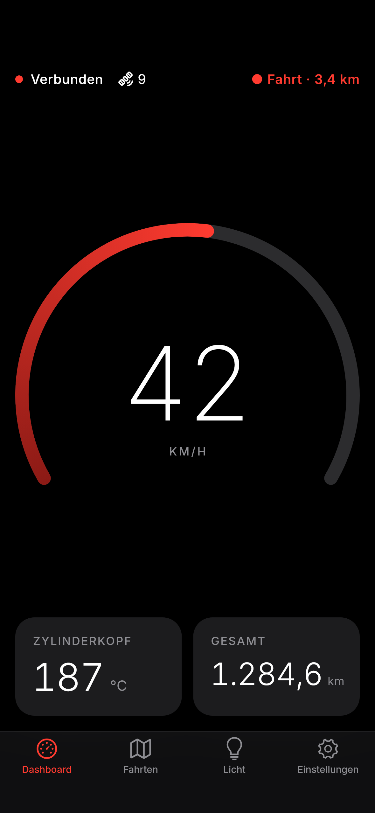
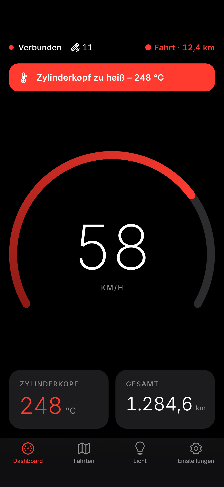
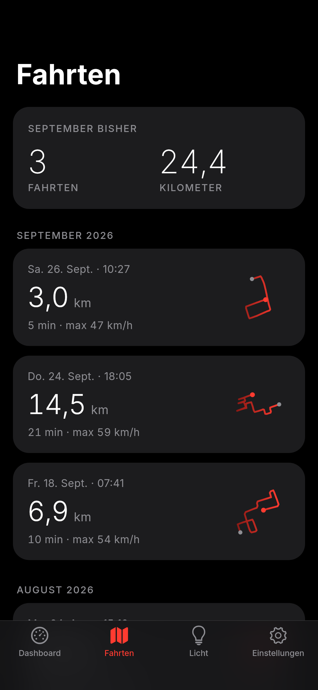
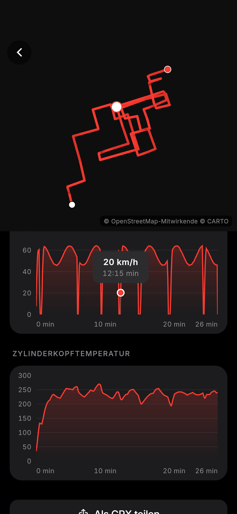
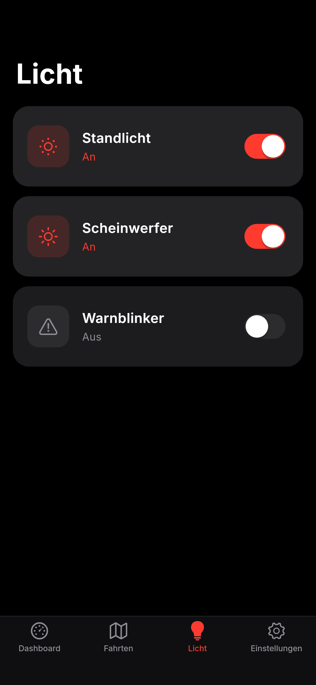
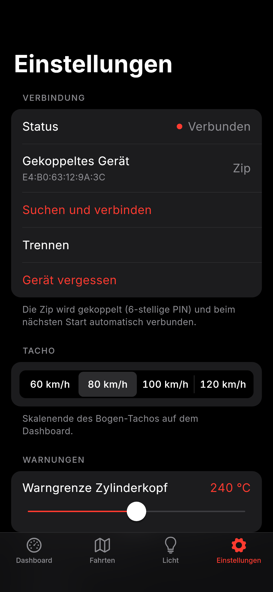

# Zip – App für die Piaggio Zip SSL 25

Flutter-App (Android und iOS) für eine Piaggio Zip SSL 25 mit 70-ccm-Zylinder. Die App verbindet
sich per Bluetooth Low Energy mit einem ESP32-S3 im Roller und bietet:

- **Dashboard:** Bogen-Tacho (GPS-Geschwindigkeit), Zylinderkopftemperatur mit Warnbanner,
  Gesamtkilometer, Verbindungs-/GPS-/Fahrtstatus. Der Bildschirm bleibt an, solange das Dashboard
  sichtbar und der Roller verbunden ist.
- **Fahrten:** Fahrten werden automatisch von der SD-Karte des Rollers übertragen (fensterweise,
  mit Lückenerkennung, Fortsetzen und CRC32-Prüfung). Die Detailansicht zeigt die Karte
  (CARTO Dark Matter), Kennzahlen, Diagramme für Geschwindigkeit und Temperatur und den
  GPX-Export.
- **Licht:** Standlicht, Scheinwerfer, Warnblinker – optimistisch geschaltet, mit Rückmeldung
  vom ESP.
- **Einstellungen:** Verbindung, Tacho-Skala, Warngrenze, Gesamtkilometer, Fahrten, Demo-Modus,
  Info.
- **Demo-Modus:** emuliert die Firmware vollständig (Live-Stadtfahrt 0–60 km/h,
  Temperaturverlauf mit gelegentlicher Warnung, vier Beispielfahrten mit Route). Damit lässt sich
  die komplette App ohne Roller ausprobieren.

Drehzahl und Batteriespannung gibt es bewusst nicht.

| Dashboard | Warnung | Fahrten | Fahrt-Detail | Licht | Einstellungen |
|---|---|---|---|---|---|
|  |  |  |  |  |  |

*Gerendert mit Flutters Test-Renderer (echte Schriften, ohne Kartenkacheln, da dort kein Netz).*

## Schnellstart

Voraussetzung: aktuelles stabiles Flutter (entwickelt und getestet mit **Flutter 3.47.5 /
Dart 3.13.4**), Android Studio bzw. Xcode.

```bash
git clone https://github.com/schmierbrot/zip-ssl-25-app.git
cd zip-ssl-25-app
flutter pub get
flutter test          # Unit-Tests
flutter analyze       # ohne Befunde
flutter run           # Gerät/Emulator auswählen
```

### 1. Im Demo-Modus starten

1. App starten, Tab **Einstellungen** öffnen.
2. Unter **Entwicklung** den **Demo-Modus** einschalten.
3. Die App „verbindet“ sich mit einem simulierten Roller. Auf dem Dashboard läuft eine
   Stadtfahrt, im Tab **Fahrten** werden vier Beispielfahrten über das echte Protokoll
   übertragen (Fortschrittsbalken oben). Einzelne Datenstücke gehen dabei absichtlich
   verloren, damit die Lückenerkennung sichtbar arbeitet.

Demo-Fahrten liegen in einer eigenen Datenbank (`zip_demo.db`) und vermischen sich nicht mit
echten Fahrten.

### 2. Mit dem ESP verbinden

1. Demo-Modus ausschalten.
2. Roller/ESP einschalten (Gerätename `Zip`, Service `f00d0001-…`).
3. Auf dem Dashboard **Verbinden** tippen (oder *Einstellungen → Suchen und verbinden*).
   Die App erklärt vorher kurz, wozu sie Bluetooth braucht; danach fragt das System nach der
   Berechtigung.
4. **Kopplung:** Android zeigt den System-Dialog für die 6-stellige PIN; auf iOS erscheint der
   Dialog beim ersten Zugriff auf eine geschützte Characteristic. Bei falscher PIN erscheint
   „Kopplung fehlgeschlagen – PIN prüfen“, und die App versucht es nicht endlos weiter.
5. Das Gerät wird gespeichert und beim nächsten Start **ohne Scan** direkt verbunden. Reißt die
   Verbindung ab, verbindet die App im Vordergrund automatisch neu (1, 2, 4, 8, 15 s …).

*Gerät vergessen* (Einstellungen) trennt, entfernt auf Android auch die Kopplung und löscht die
gespeicherte Geräte-ID. Auf iOS muss die Kopplung zusätzlich in den iOS-Bluetooth-Einstellungen
ignoriert werden (eine App kann das dort nicht selbst).

### Projekt von Grund auf anlegen (falls gewünscht)

Das Repository enthält bereits das komplette Projekt inklusive `android/` und `ios/`. Wer die
Dateien in ein frisches Projekt übernehmen will:

```bash
flutter create --org de.schmierbrot --project-name zip_app --platforms android,ios zip_app
# danach aus diesem Repository übernehmen:
#   lib/, test/, assets/, pubspec.yaml, analysis_options.yaml
#   android/app/src/main/AndroidManifest.xml
#   android/app/build.gradle.kts           (minSdk = 24)
#   android/app/src/main/res/…              (schwarzer Startbildschirm, optional)
#   ios/Runner/Info.plist                   (NSBluetoothAlwaysUsageDescription)
flutter pub get
```

## iOS-IPA mit Codemagic

Ohne eigenen Mac baut [Codemagic](https://codemagic.io) die iOS-App. Die Konfiguration liegt in
`codemagic.yaml`, Workflow **`ios-ipa`** (läuft auf `mac_mini_m2`, im kostenlosen Plan
enthalten):

1. In Codemagic die App öffnen, *Check for configuration files* klicken.
2. *Start new build* → Branch wählen → Workflow **„iOS-IPA (unsigniert)“**.
3. Nach etwa 10–15 Minuten liegt auf der Build-Seite unter *Artifacts* die Datei
   `Zip-<Version>-<Build>.ipa`.

Die IPA ist **unsigniert** – Apple erlaubt die Installation nur mit Signatur. Die übernimmt ein
Sideload-Werkzeug beim Installieren mit deiner normalen Apple-ID (kein Developer-Konto nötig):

- **Sideloadly** (Windows/macOS): iPhone per Kabel anschließen, IPA hineinziehen, Apple-ID
  eingeben, *Start*.
- **AltStore** (Windows/macOS): AltServer installieren, AltStore aufs iPhone bringen, dann in
  AltStore unter *My Apps → +* die IPA öffnen.

Danach auf dem iPhone:

- *Einstellungen → Allgemein → VPN und Geräteverwaltung* → deine Apple-ID → *Vertrauen*.
- Ab iOS 16 zusätzlich *Einstellungen → Datenschutz & Sicherheit → Entwicklermodus* einschalten
  (iPhone startet neu).

Mit einer kostenlosen Apple-ID läuft die Signatur **nach 7 Tagen ab**. Dann die App neu
signieren (AltStore erledigt das automatisch im WLAN, Sideloadly per erneutem Installieren).
Beim Neu-Signieren mit derselben Apple-ID bleiben die gespeicherten Fahrten in der Regel erhalten.
Bluetooth funktioniert in sideloaded Apps ganz normal.

### Signiert über TestFlight (optional)

Mit Apple Developer Program (99 €/Jahr) geht es ohne 7-Tage-Grenze über TestFlight. Dafür in
`codemagic.yaml` den auskommentierten Workflow `ios-testflight` aktivieren und einmalig
einrichten:

1. In App Store Connect unter *Benutzer und Zugriff → Integrationen → App Store Connect API*
   einen Schlüssel mit Rolle *App Manager* anlegen (`.p8`, Issuer-ID, Key-ID).
2. In Codemagic unter *Team settings → Team integrations → Developer Portal → Manage keys* als
   **`zip_asc`** hinterlegen.
3. *Code signing identities → iOS certificates → Generate certificate* (Apple Distribution).
4. Im Apple Developer Portal die App-ID **`de.schmierbrot.zipApp`** und ein Profil *App Store
   Connect* anlegen, dann in Codemagic unter *iOS provisioning profiles → Fetch profiles* laden.
5. In App Store Connect die App mit dieser Bundle-ID anlegen, Workflow starten, sich unter
   *TestFlight* als interne:r Tester:in eintragen und die App über die TestFlight-App laden.

`ITSAppUsesNonExemptEncryption = false` steht bereits in der `Info.plist`, damit entfällt die
Frage nach der Exportkontrolle.

## Aufbau

```
lib/
  main.dart                    Start, Orientierung, SharedPreferences, ProviderScope
  app.dart                     Theme, Tab-Leiste (Blur), Lebenszyklus, Wakelock, Hinweise
  core/
    theme.dart                 Farben, Schrift (Inter), Abstände, Radien, Animationen
    haptics.dart               Haptisches Feedback
    format.dart                Deutsche Zahlen-/Datumsformate, Zahleneingabe
    toast.dart                 Kurze Meldungen
    providers.dart             Riverpod: Einstellungen, Datenquelle, Client, Zustände, DB
    zip_session.dart           Nach jedem Verbinden: Info (0x06), Warngrenze, Fahrten-Sync
  ble/
    zip_protocol.dart          UUIDs, Opcodes, Parser/Builder aller Pakete, CRC32
    command_queue.dart         Befehlswarteschlange (ein offener Befehl, 5 s, 1 Wiederholung)
    zip_client.dart            Protokollschicht über der Datenquelle (typisierte Befehle)
    zip_connection.dart        Echte BLE-Verbindung: Scan, Verbinden, MTU, Kopplung, Reconnect
    trip_sync.dart             Fahrten-Download mit Fenstern, Lücken, Fortsetzen, CRC
  data/
    models.dart                Telemetry, LightState, TripEntry, TripPoint, TripSummary, AppSettings …
    zip_data_source.dart       Abstraktion ZipDataSource (BLE oder Demo)
    demo_source.dart           Demo-Modus: emulierte Firmware + Beispielfahrten
    trip_database.dart         sqflite
    trip_file_parser.dart      Fahrtdatei-Parser, Kennzahlen, Routen-Vorschau
    gpx_export.dart            GPX 1.1
  features/
    dashboard/  trips/  lights/  settings/  common/
  widgets/
    arc_gauge.dart             Bogen-Tacho (CustomPainter)
    stat_tile.dart  warning_banner.dart  route_preview.dart  settings_group.dart …
test/
  zip_protocol_test.dart       alle Parser/Builder inkl. Randfälle, CRC32
  trip_file_parser_test.dart   Fahrtdatei, Kennzahlen, Vorschau
  command_queue_test.dart      Warteschlange, Timeout, Wiederholung, Fehlercodes
  trip_sync_test.dart          Synchronisation Ende-zu-Ende gegen die emulierte Firmware
  format_test.dart             Formate, Zahleneingabe, GPX
```

**Datenfluss:** `ZipDataSource` liefert *rohe Pakete* genau wie die Characteristics der Firmware –
entweder von `ZipConnection` (flutter_blue_plus) oder von `DemoSource`, die die Firmware auf
Byte-Ebene emuliert. Darüber liegt `ZipClient` (Parser + Befehlswarteschlange) und darüber
`TripSync`. Die Oberfläche merkt keinen Unterschied zwischen Demo und echtem Roller.

## BLE-Protokoll

Verbindlich und identisch in der Firmware (siehe Pflichtenheft). Alle Mehrbyte-Werte Little
Endian. Kurzfassung:

| Characteristic | UUID | Eigenschaften |
|---|---|---|
| Telemetrie (16 Bytes, 5 Hz) | `f00d0002-a1b2-4c3d-8e9f-5a1b2c3d4e5f` | READ, NOTIFY |
| Licht (1 Byte) | `f00d0003-a1b2-4c3d-8e9f-5a1b2c3d4e5f` | READ, WRITE, NOTIFY |
| Steuerung | `f00d0005-a1b2-4c3d-8e9f-5a1b2c3d4e5f` | WRITE |
| Antwort | `f00d0006-a1b2-4c3d-8e9f-5a1b2c3d4e5f` | NOTIFY |

Befehle `0x01`–`0x06`, Antworten `0x81`–`0x86` und `0xFF` sind in `lib/ble/zip_protocol.dart`
umgesetzt und in `test/zip_protocol_test.dart` byteweise geprüft.

## Plattform-Konfiguration

**Android** – `android/app/src/main/AndroidManifest.xml`:

```xml
<manifest xmlns:android="http://schemas.android.com/apk/res/android"
    xmlns:tools="http://schemas.android.com/tools">
    <!-- Android 12+ -->
    <uses-permission android:name="android.permission.BLUETOOTH_SCAN"
        android:usesPermissionFlags="neverForLocation" tools:targetApi="s" />
    <uses-permission android:name="android.permission.BLUETOOTH_CONNECT" />
    <!-- Android ≤ 11 -->
    <uses-permission android:name="android.permission.BLUETOOTH" android:maxSdkVersion="30" />
    <uses-permission android:name="android.permission.BLUETOOTH_ADMIN" android:maxSdkVersion="30" />
    <uses-permission android:name="android.permission.ACCESS_FINE_LOCATION" android:maxSdkVersion="30" />
    <uses-permission android:name="android.permission.ACCESS_COARSE_LOCATION" android:maxSdkVersion="30" />
    <uses-feature android:name="android.hardware.bluetooth_le" android:required="true" />
    <uses-feature android:name="android.hardware.location" android:required="false" />
    <!-- Kartenkacheln -->
    <uses-permission android:name="android.permission.INTERNET" />
    …
```

`android/app/build.gradle.kts`: `minSdk = 24` (siehe unten).

**iOS** – `ios/Runner/Info.plist`:

```xml
<key>NSBluetoothAlwaysUsageDescription</key>
<string>Die App verbindet sich per Bluetooth mit deiner Piaggio Zip, um Geschwindigkeit,
Zylinderkopftemperatur und Fahrten anzuzeigen und das Licht zu schalten.</string>
```

## Abweichungen, Annahmen, offene Punkte

Ehrlich aufgeschrieben, wo die Umsetzung vom Pflichtenheft abweicht oder etwas annimmt:

- **minSdk 24 statt 21.** Das aktuelle stabile Flutter (3.47) bricht den Gradle-Build bei
  `minSdk < 23` ab, und `shared_preferences_android` verlangt API 24. Android 7.0 ist damit das
  technisch mögliche Minimum. Die Legacy-Berechtigungen für Android ≤ 11 bleiben nötig und sind
  enthalten.
- **flutter_blue_plus 2.x:** `connect()` verlangt einen Lizenzparameter. Verwendet wird
  `License.nonprofit` (private Nutzung). Für eine kommerzielle Nutzung ist eine Lizenz nötig.
- **Berechtigungen:** flutter_blue_plus fragt die Android-Berechtigungen beim Scannen/Verbinden
  selbst an. Daher kommt kein zusätzliches Paket (`permission_handler`) zum Einsatz. Die App
  erklärt vorher, wozu sie Bluetooth braucht, und zeigt bei Ablehnung einen Hinweis mit dem Weg
  in die Systemeinstellungen. Ein Button, der die App-Einstellungen direkt öffnet, fehlt deshalb.
- **Erkennung fehlgeschlagener Kopplung:** Android und iOS melden das mit unterschiedlichen
  Codes. Die App erkennt es an Begriffen in der Fehlermeldung (z. B. `AUTHENTICATION_FAILURE`,
  `PIN_OR_KEY_MISSING`, `INSUFFICIENT_ENCRYPTION`, „Peer removed pairing information“). Das ist
  eine Heuristik und sollte mit dem echten ESP einmal mit falscher PIN geprüft werden.
- **Annahmen zur Firmware beim Fahrten-Download** (bitte in der Firmware so umsetzen oder
  Rückmeldung geben):
  - Ein `0x02` mit `offset == Dateigröße` beantwortet der ESP nur mit `0x84` (Dateiende mit
    CRC). Das kommt vor, wenn das letzte Datenstück ein Fenster exakt füllt.
  - Alle `0x83`-Stücke einer Datei haben dieselbe Länge (außer dem letzten). Das hilft nur beim
    schnellen Erkennen des Fensterendes; sonst greift ein kurzes Warte-Timeout (1,5 s).
  - Falls die gerade aufgezeichnete Fahrt in der Liste auftaucht: Die App lädt sie, erkennt aber
    später an der größeren `dateiGroesse`, dass sie gewachsen ist, und lädt sie erneut.
    Solange „Fahrt läuft“ gesetzt ist, wird die neueste Fahrt **nie** auf dem Roller gelöscht.
- **Lokal gelöschte Fahrten** werden gemerkt und nicht erneut übertragen, auch wenn sie noch
  auf dem Roller liegen. Fahrten werden über `tripId` **und** Startzeit identifiziert, damit
  eine formatierte SD-Karte (tripIds beginnen neu) keine Verwechslung auslöst.
- **Lichtzustand:** Maßgeblich ist das Notify der Licht-Characteristic. Das Lichtbyte der
  Telemetrie dient nur als Rückfallebene und wird kurz nach einem Notify ignoriert, damit
  nichts flackert.
- **Karte:** CARTO-Basiskarten sind ohne API-Key nutzbar, aber für nicht-kommerzielle Nutzung
  in begrenztem Umfang gedacht. Die Attribution „© OpenStreetMap-Mitwirkende © CARTO“ wird
  angezeigt.
- **Schrift:** Inter liegt gebündelt unter `assets/google_fonts/` (SIL Open Font License, siehe
  `OFL.txt`). Die App lädt keine Schriften aus dem Netz.
- **Nicht auf echter Hardware getestet:** `flutter analyze` ist ohne Befunde, alle Unit-Tests
  laufen, und ein Android-APK baut mit dem hier gezeigten Manifest (geprüft mit Flutter 3.47.5,
  Android SDK 36). BLE-Verbindung, Kopplung und Hintergrund-/Vordergrundwechsel mit dem echten
  ESP konnten ohne Gerät nicht geprüft werden. Einen iOS-Build konnte ich ohne macOS nicht
  ausführen – der Codemagic-Workflow `ios-ipa` holt das nach.
